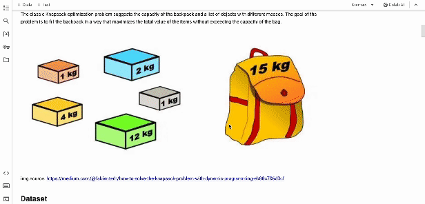

# Knapsack Problem - Search Algorithms Comparison

The overarching goal of this assignment is to test
different search algorithms on the classic knapsack problem. 

The objective is also to become familiar with the experimental approach necessary 
for comparing three search algorithms and reporting the comparative results.

### Quick Overview

## Project Preliminaries

This project was written, translated and revised by Céleste Duguay. Some algorithm contributions by colleague David Lumbu from the unrevised submitted copy. 

This project was made in the scope of the 4th year course Introduction to Artificial Intelligence offered by the department of Computer Science at the University of Ottawa.

This is the production copy, after received retroaction. This copy does not have the writeent analysis component.

Grade: A 

### Project  Requirements:

- Programming in Python.
- Use Kaggle for datasets and competition exploration.
- Implement three search algorithms: Greedy search, Simulated Annealing, and Genetic Algorithm.
- Conduct an empirical and comparative study using the implemented algorithms and dataset.
- Document all aspects of the empirical study comprehensively in a Jupyter Notebook.

### Expected Outcomes:

- An in-depth comparison of the implemented search algorithms.
- A well-documented empirical study in a Jupyter Notebook for clear understanding and reproducibility.

### How does it work?

This project was made using Google Colaboratory, also known as Colab, is a cloud-based platform provided by Google 
that offers free access to Jupyter notebooks and a computing environment with GPU support. 

Here is the link of the Colab [ here](https://colab.research.google.com/drive/1Ze7zxpjYKScQ3rFvqFimAFnMUCJJtSZt?usp=sharing).
* Know by clicking the link you will be shared the copy of the prod version as a viewer and I will have access to your Google Account. 

Can also be found in this Github Repository.

### ToDo
- [ ] Translate code
- [ ] Add revised code for certain algorithms
- [X] Translate text, description from FR to ENG
